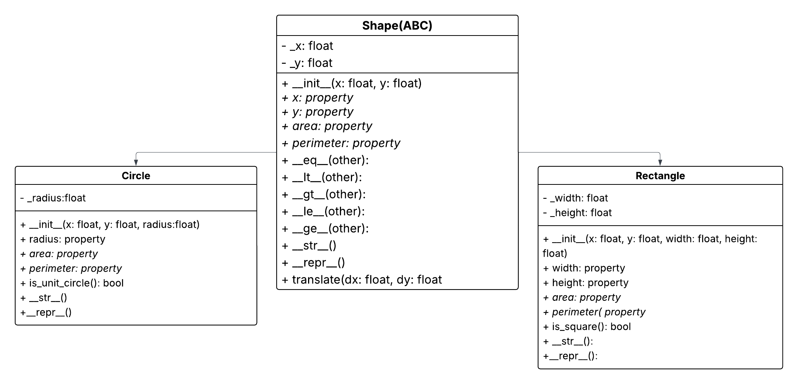

# Geometry & OOP

A Python project implementing geometric shapes using Object-Oriented Programming. The focus was on inheritance, encapsulation, and operator overloading.

## Project Overview

The project contains:

- An **abstract base class** `Shape` that holds shared logic (position, movement, comparisons).
- `Circle` and `Rectangle` classes inheriting from `Shape`.
- **Properties** (`@property`) for `area` and `perimeter`.
- **Operator overloading** (`==`, `<`, `>`, etc.) for comparing shapes by size.
- Input validation preventing negative dimensions or non-numeric values.
- A `utils.py` file for reusable validation logic (**DRY** principle).

### Bonus Features

- 3D shapes `Cube` and `Sphere` (independent classes — 2D/3D logic differs enough to warrant separation).
- A `Shape2DPlotter` class that renders 2D shapes using `matplotlib`.
- Unit tests with `pytest` for the 3D classes.

---

## UML Plan

The diagram below shows the planned class hierarchy for the 2D shapes. `Shape` acts as an abstract parent with shared attributes (`x`, `y`) and methods (`translate`), which `Circle` and `Rectangle` inherit and extend.



---

## Class Structure

### Shape (Abstract Base Class)

- **Attributes**: `x`, `y` (position)
- **Abstract properties**: `area`, `perimeter` — must be implemented by all subclasses
- **Methods**:
  - `translate(dx, dy)` — moves the shape
  - Comparison operators: `==`, `<`, `>`, `<=`, `>=`
  - `__repr__()` and `__str__()` for readable output

### Rectangle

- **Extra attributes**: `width`, `height`
- **Properties**:
  - `area` → `width * height`
  - `perimeter` → `2 * (width + height)`
  - `is_square` → checks if width equals height
- **Validation**: `width` and `height` must be positive numbers

### Circle

- **Extra attribute**: `radius`
- **Properties**:
  - `area` → `π × radius²`
  - `perimeter` → `2π × radius`
  - `is_unit_circle` → checks if radius is 1 and center is at (0, 0)
- **Validation**: `radius` must be a positive number

---

## Usage Examples

```python
from circle import Circle
from rectangle import Rectangle

# Create shapes
circle = Circle(x=0, y=0, radius=1)       # unit circle
rectangle = Rectangle(x=0, y=0, width=5, height=3)

# Compare shapes (by area)
print(circle == rectangle)  # False

# Move a shape
circle.translate(5, 3)
print(f"New position: ({circle.x}, {circle.y})")  # (5.0, 3.0)

# Check properties
print(f"Circle area: {circle.area:.2f}")           # 3.14
print(f"Is rectangle a square? {rectangle.is_square}")  # False
```

### Error Handling

Validation runs through property setters, so it applies both at creation and when updating values:

```python
try:
    circle = Circle(radius=-5)
except ValueError as e:
    print(e)  # "The radius cannot be negative"

try:
    rectangle = Rectangle(width="five", height=3)
except TypeError as e:
    print(e)  # "must be a number"
```

---

## Bonus: Visualisation with Plotter

```python
from shape2dplotter import Shape2DPlotter
from circle import Circle
from rectangle import Rectangle

plotter = Shape2DPlotter(title="My Shapes")
plotter.add_shape(Circle(x=5, y=5, radius=4))
plotter.add_shape(Rectangle(x=0, y=0, width=3, height=6))
plotter.add_shape(Rectangle(x=-8, y=2, width=2, height=2))  # square
plotter.show_plot()
```

---

## Design Decisions

**Inheritance** — `Shape` as an abstract base class enforces a contract: every 2D shape must implement `area` and `perimeter`. This makes the design extensible — adding a new shape only requires inheriting from `Shape` and implementing those two properties.

**Validation in setters** — All validation (type checks, negative value guards) lives in property setters rather than `__init__`. This ensures the object stays valid even if attributes are updated after creation (e.g. `c.radius = -5` will still raise).

**Comparison logic** — Shapes are first compared by `area`. If areas are equal, `perimeter` acts as a tiebreaker.

**Float comparisons** — `math.isclose()` is used instead of `==` when comparing floats (e.g. in `is_square`) to avoid classic floating-point rounding errors.

**3D shapes as independent classes** — `Cube` and `Sphere` do not inherit from `Shape` since 3D and 2D logic (volume vs. area, surface area vs. perimeter) diverge enough that a shared base class would add unnecessary complexity.

---

## Running Tests

```bash
pytest
```

All unit tests for the 3D classes (`test_cube.py`, `test_sphere.py`) should pass.

The 2D files (`circle.py`, `rectangle.py`) also contain manual test blocks under `if __name__ == "__main__":` that can be run directly.

---

## Project Structure

```
lab_2_geometry_oop/
├── README.md
├── Uml_lab2.png
│
├── shape.py            # Abstract base class (2D)
├── rectangle.py        # Rectangle class (2D)
├── circle.py           # Circle class (2D)
├── utils.py            # Shared validation helper
│
├── shape2dplotter.py   # Bonus: 2D shape visualiser
│
├── cube.py             # Bonus: Cube class (3D)
├── sphere.py           # Bonus: Sphere class (3D)
│
├── test_cube.py        # Bonus: pytest for Cube
└── test_sphere.py      # Bonus: pytest for Sphere
```

---

## References

- [Python ABC Module](https://docs.python.org/3/library/abc.html) — Abstract base classes
- [Real Python — Python Property](https://realpython.com/python-property/) — Property decorators
- [pytest documentation](https://docs.pytest.org/en/stable/how-to/assert.html) — Testing expected exceptions
- [Python Data Model](https://docs.python.org/3/reference/datamodel.html) — Dunder methods
- [matplotlib Patches — Circle](https://matplotlib.org/stable/api/_as_gen/matplotlib.patches.Circle.html)
- [matplotlib Patches — Rectangle](https://matplotlib.org/stable/api/_as_gen/matplotlib.patches.Rectangle.html)

### AI Usage

Claude/ChatGPT was used as a sounding board during development — for feedback on code structure, debugging validation issues, and help with `Shape2DPlotter`. All core logic was written independently.

---

## Author

Rickard Garnau
